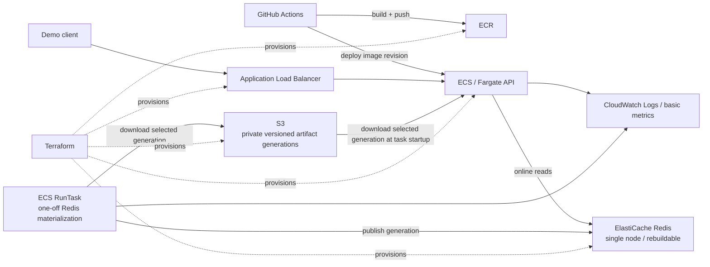

# Sift AWS Deployment Plan

> **Status:** Deployment ground truth for the short-lived AWS showcase.
>
> **Goal:** Deploy the existing Sift serving system to AWS in a way that is reproducible, explainable, inexpensive, and faithful to the project's existing design. This is a deployment task, **not** a cloud-platform rewrite.
>
> **Expected lifetime:** Approximately one day after validation/showcase, then destroy the paid infrastructure.

## 1. Ground rules

This document is the source of truth for AWS-specific work. Existing Sift decisions remain authoritative for the application itself.

Agents working on this deployment must follow these rules:

1. **Do not redesign Sift to fit AWS.** AWS should host the system that already exists.
2. **No new AWS service without a concrete requirement.** "It is a production service" is not enough justification.
3. **Prefer the smallest deployment that proves the architecture works.** This environment is intentionally short-lived.
4. **Do not turn the offline path into a cloud data platform.** No Airflow, Step Functions, Glue, EMR, SageMaker, or scheduled retraining.
5. **Do not add Kubernetes.** One service does not justify EKS.
6. **Do not make Redis durable.** Sift already treats Redis as rebuildable serving state.
7. **Do not expose Yelp data or derived artifacts publicly.** S3 buckets, ECR repositories, Redis, and deployment artifacts remain private.
8. **Do not commit Terraform state, raw Yelp data, derived Yelp data, model artifacts, secrets, or generated deployment bundles to Git.**
9. **The local serving path must be internally consistent before cloud work is considered complete.** Resolve any current Sift issue that means the API is serving a displaced model, cannot supply one of its required online features, or violates a stated latency/correctness contract before declaring the AWS deployment successful.
10. **If a proposed AWS change conflicts with `.agents/DECISIONS.md`, `.agents/AGENTS.md`, or the project's correctness guarantees, stop and surface the conflict instead of silently changing the application architecture.**

---

## 2. What is being deployed

Sift remains a two-plane system:

- **Offline/local build plane:** produce the tested/versioned Sift artifacts using the existing pipeline.
- **AWS online plane:** load a selected artifact generation, materialize the rebuildable Redis serving state, and serve recommendations through FastAPI.

The AWS deployment is **not required to retrain the entire model stack in the cloud**. The value of this deployment is demonstrating a real containerized serving architecture, artifact lifecycle, online feature store, networking, infrastructure-as-code, CI/CD, and observability.

### Required AWS architecture



### Required services/tools

- **Amazon S3** — private durable artifact store.
- **Amazon ECR** — private container registry.
- **Amazon ECS on Fargate** — one long-lived FastAPI service plus one-off bootstrap/materialization tasks.
- **Application Load Balancer** — stable demo entrypoint and health checking.
- **Amazon ElastiCache for Redis** — rebuildable online serving store.
- **VPC + subnets + security groups** — network isolation.
- **Terraform** — infrastructure-as-code.
- **GitHub Actions + AWS OIDC** — build/push/deploy workflow without long-lived AWS keys.
- **CloudWatch Logs + basic AWS metrics** — enough observability to validate the deployment.

---

## 3. Explicit non-goals

Do **not** add any of the following for this deployment unless this document is deliberately revised first:

- EKS / Kubernetes
- SageMaker
- Glue
- EMR
- Step Functions
- Airflow / Dagster
- MemoryDB
- RDS / Aurora
- OpenSearch / pgvector / managed ANN
- API Gateway
- CodePipeline / CodeBuild
- EventBridge scheduled retraining
- NAT Gateway
- Multi-AZ Redis replication
- Redis snapshots as a durability mechanism
- Auto Scaling for the ECS service
- Route 53 / ACM solely to make a one-day demo look more production-like
- Secrets Manager or SSM Parameter Store for values that can safely be ordinary ECS configuration
- a second deployment framework alongside Terraform

The absence of these services is intentional, not incomplete architecture.

---

## 4. Artifact model

### S3 is the durable deployment source of truth

A deployment uses an **immutable artifact generation**, not a loose collection of independently updated files.

Recommended key shape:

```text
s3://<private-bucket>/sift/artifacts/<generation-id>/
    manifest.json
    ...files required by API startup...
    ...files required by Redis materialization...
```

`generation-id` should be immutable and traceable. Good choices include:

- Git commit SHA, or
- timestamp + short Git SHA.

Example:

```text
sift/artifacts/2026-07-29-a1b2c3d/
```

`manifest.json` should identify at minimum:

- artifact generation ID
- Git commit SHA
- creation timestamp
- expected files
- selected retrieval/ranker artifact versions
- schema/version information needed to reject an incompatible bundle

### Important distinction: S3 versioning vs. Sift generations

Enable S3 bucket versioning if convenient, but **S3 object versioning is not the deployment consistency mechanism**.

The consistency mechanism is the immutable Sift generation directory + manifest. A deployment must never accidentally combine an item-factor matrix from one run with IDs/model metadata from another.

### Data policy

- Bucket is private.
- Block Public Access stays enabled.
- No raw Yelp data is required in AWS for the required deployment path.
- Prefer uploading only the derived files required to reproduce the online state and run the API.
- Never commit these artifacts to GitHub.

---

## 5. Container strategy

### One application image

Use **one ECR image** for the deployment. Different ECS commands may use the same image for different roles.

Required roles:

1. **API service** — downloads the chosen deployable artifact subset and starts FastAPI/Uvicorn.
2. **Redis bootstrap/materialization task** — downloads the chosen generation, runs the existing online materialization path against ElastiCache, verifies success, and exits.

Do not spend the project deadline creating multiple highly optimized images unless image size/startup becomes a measured problem.

### Dockerfile

Sift currently has Docker Compose for Redis, but the Python application itself needs a real `Dockerfile` for AWS.

The container must:

- use the project's pinned Python version/dependency lock
- install required native runtime dependencies
- install Sift
- run as a non-root user where practical
- expose the FastAPI port
- contain a health-compatible API command
- support alternate commands for API vs. materialization tasks

### S3 downloads

Do not install the full AWS CLI merely to copy artifacts if a small Python bootstrap is sufficient.

Preferred approach:

- add/use the AWS SDK for Python for artifact download
- rely on the ECS task role for credentials
- provide the bucket and generation through environment variables

Suggested variables:

```text
SIFT_ARTIFACT_BUCKET
SIFT_ARTIFACT_GENERATION
SIFT_REDIS_URL
```

The bootstrap must fail fast if the manifest or required files are incomplete/incompatible.

---

## 6. ECS / Fargate design

### API service

Run exactly **one desired ECS task** for the demo.

Start with a modest task size (for example, around 0.5 vCPU / 1 GB) and validate memory/latency rather than over-sizing preemptively.

The task should:

1. download the chosen serving artifact generation from S3 at startup
2. initialize the existing Sift serving components
3. connect to ElastiCache through `SIFT_REDIS_URL`
4. start Uvicorn/FastAPI
5. answer `/health`
6. emit logs to CloudWatch

No autoscaling is required.

### One-off bootstrap/materialization task

Use `ecs run-task` / the ECS RunTask API for Redis publication.

This is **not a scheduled training system**.

The task should:

1. download the selected artifact generation from S3
2. connect to the private ElastiCache endpoint
3. run Sift's online materialization/publication path
4. preserve Sift's generation-switch semantics in Redis
5. verify that an active generation exists and required records are readable
6. exit successfully

The same task definition family/image may be reused with a different command.

### Full AWS training is optional and out of required scope

If the current local pipeline already produces the deployment artifacts correctly, **do not migrate model training to AWS solely for resume keywords**.

If there is substantial time left after the required deployment is complete, a manually invoked Fargate batch run may be explored separately. It must not block the deployment milestone.

---

## 7. Networking

Use a small VPC with **no NAT Gateway**.

### Subnets

Recommended layout across two Availability Zones:

- **Public subnet A/B**
  - Application Load Balancer
  - ECS/Fargate API task(s), with public IP assignment enabled so they can reach ECR/S3/CloudWatch without a NAT gateway
- **Private subnet A/B**
  - ElastiCache subnet group

The ECS task may have a public IP, but that does **not** mean the application container is publicly reachable directly.

### Security groups

Use separate groups:

#### ALB security group

Inbound:

- default demo mode: application listener from the user's current public IP `/32`
- only use `0.0.0.0/0` if the deployed data/output is explicitly safe for public demonstration

Outbound:

- API task security group on application port

#### ECS API security group

Inbound:

- application port **only from the ALB security group**

No direct world ingress.

Outbound:

- Redis port to Redis security group
- HTTPS outbound for AWS service access/artifact download

#### Redis security group

Inbound:

- Redis port **only from ECS task security group(s)**

No public IP. No public ingress.

### Why no NAT gateway

A NAT gateway adds fixed cost and does not improve the showcase meaningfully. Public-subnet Fargate tasks with tightly restricted inbound rules are an acceptable simplification for this short-lived environment.

Do not replace the NAT gateway with a large collection of paid VPC interface endpoints unless a concrete security requirement justifies them.

---

## 8. Load balancer

Use an **Application Load Balancer** with a target group pointing to the ECS service.

Required:

- `/health` target-group health check
- listener forwarding to the ECS target group
- ECS service registered by IP target type

### HTTP vs. HTTPS

For the one-day, IP-restricted demo, an HTTP listener is acceptable if no secrets/sensitive traffic are sent through the endpoint.

Do **not** add Route 53 + a custom domain + ACM solely to obtain HTTPS for a disposable environment.

If a suitable domain already exists and HTTPS is trivial, TLS can be added, but it is optional.

---

## 9. ElastiCache design

Redis is a **serving cache/materialization**, not the durable source of truth.

Required configuration:

- one node
- no replicas
- no Multi-AZ requirement
- no persistence/snapshot design whose purpose is to make Redis authoritative
- private subnets only
- security group permitting Redis only from ECS tasks

If the node disappears, the recovery procedure is:

```text
S3 artifact generation -> one-off materialization task -> new Redis generation -> service resumes
```

That is intentional and should be explainable in an interview.

Do not replace ElastiCache with MemoryDB.

---

## 10. IAM

Use IAM roles rather than static AWS access keys.

### ECS task execution role

Only the standard permissions needed for:

- pulling the image from ECR
- writing container logs

### Application task role

Grant only the data-plane permissions the task needs, principally:

- `s3:GetObject` / `s3:ListBucket` for the deployment artifact prefix

Redis access is network-level; do not give the app broad AWS permissions it does not use.

### GitHub Actions

Use **GitHub OIDC federation**.

Do not store permanent AWS access key / secret key pairs in GitHub Secrets.

The CI/CD role should be scoped to the actions needed for the workflow, such as:

- authenticate/push to the specific ECR repository
- register/update the ECS task/service as needed

### Terraform credentials

For this short-lived solo environment, running `terraform apply` / `terraform destroy` from the developer machine is acceptable and keeps CI IAM simpler.

Do not build a remote Terraform-state platform solely for this demo.

Local Terraform state must be ignored by Git and retained until teardown succeeds.

---

## 11. Terraform layout

Suggested repository layout:

```text
infra/
  aws/
    versions.tf
    providers.tf
    variables.tf
    networking.tf
    s3.tf
    ecr.tf
    iam.tf
    redis.tf
    alb.tf
    ecs.tf
    cloudwatch.tf
    outputs.tf
```

Exact file names are not important. Clear resource ownership is.

Useful Terraform outputs:

- ALB DNS name
- ECR repository URL
- artifact bucket name
- ECS cluster/service names
- Redis endpoint (sensitive if appropriate)

### Terraform requirements

- `terraform fmt` clean
- `terraform validate` passes
- repeated `terraform plan` is understandable
- `terraform destroy` is tested/usable
- no credentials or state committed

---

## 12. GitHub Actions CI/CD

Keep GitHub Actions as the CI/CD system. Do not add CodePipeline or CodeBuild.

### Existing CI remains authoritative for application quality

Before deploying an image, the workflow should run the repository's normal checks/tests.

### Deployment workflow

Recommended deployment trigger:

- manual `workflow_dispatch` for this showcase, optionally also a tag-based trigger

Recommended steps:

1. checkout
2. authenticate to AWS through OIDC
3. run required tests/checks
4. build Docker image
5. tag with Git SHA
6. push image to ECR
7. register/update ECS task definition image reference
8. update ECS service
9. wait for ECS service stability
10. optionally run a smoke test against `/health`

Do not make every commit to `main` automatically deploy a paid demo environment unless that is explicitly desired.

---

## 13. Observability

The goal is to prove that Sift's existing latency/correctness story survives deployment, not to build an observability platform.

Required:

- API logs in CloudWatch Logs
- bootstrap/materialization task logs in CloudWatch Logs
- ALB target health visible
- ECS task health/status visible
- existing Sift stage latency instrumentation preserved

Recommended validation:

- run a deterministic request sample through the **ALB endpoint**, not just in-process
- record p50/p95/p99 for end-to-end requests
- preserve per-stage timings from Sift where available
- compare cloud behavior with local expectations

A small CloudWatch dashboard is optional. Custom metrics/alarms are optional unless they are quick and clearly useful.

---

## 14. Deployment sequence

### Phase 0 — Local readiness

Before AWS implementation:

- [ ] current intended online model/path is the one the API actually serves
- [ ] required online features are servable
- [ ] current correctness/skew tests pass
- [ ] current latency result is understood
- [ ] repository test/lint/type-check baseline passes as expected

Do not debug an unresolved application architecture problem through ECS.

### Phase 1 — Containerize Sift

- [ ] add application `Dockerfile`
- [ ] build locally
- [ ] run API container locally against Redis
- [ ] verify `/health`
- [ ] verify a representative recommendation request
- [ ] verify alternate materialization/bootstrap command

### Phase 2 — Artifact packaging

- [ ] define deployment manifest
- [ ] package only required derived artifacts
- [ ] verify a fresh local directory can boot from that package
- [ ] add S3 download/bootstrap code

A deployable generation must be self-contained enough that the AWS task does not depend on files accidentally present on the developer laptop.

### Phase 3 — Terraform infrastructure

Create:

- [ ] VPC
- [ ] two public subnets
- [ ] two private subnets
- [ ] route tables / internet gateway as required
- [ ] security groups
- [ ] private S3 artifact bucket
- [ ] ECR repository
- [ ] ElastiCache single-node Redis
- [ ] CloudWatch log groups
- [ ] ECS cluster
- [ ] ECS task definitions/service
- [ ] ALB + target group + listener
- [ ] IAM roles/policies

Then:

- [ ] `terraform fmt`
- [ ] `terraform validate`
- [ ] `terraform plan`
- [ ] `terraform apply`

### Phase 4 — Publish artifacts and Redis state

- [ ] upload one immutable artifact generation to S3
- [ ] verify its manifest
- [ ] run one-off ECS materialization task
- [ ] inspect CloudWatch logs
- [ ] verify active Redis generation exists

### Phase 5 — Deploy API

- [ ] push image to ECR
- [ ] deploy ECS service
- [ ] target becomes healthy in ALB
- [ ] `/health` succeeds through ALB
- [ ] recommendation request succeeds through ALB

### Phase 6 — GitHub Actions

- [ ] configure GitHub OIDC AWS role
- [ ] manual deployment workflow succeeds end to end
- [ ] image is tagged with Git SHA
- [ ] workflow updates ECS without static AWS credentials

### Phase 7 — Validate

- [ ] run cloud request benchmark through ALB
- [ ] save p50/p95/p99 output locally / as a safe repo artifact if appropriate
- [ ] inspect CloudWatch logs
- [ ] confirm Redis is private
- [ ] confirm ECS app port is not directly open to the internet
- [ ] confirm artifact bucket is private
- [ ] confirm no raw/derived data has been committed

### Phase 8 — Destroy   ✅ COMPLETE (2026-08-01)

After the showcase/evidence capture:

- [x] save only non-sensitive screenshots/log summaries needed for portfolio evidence
- [x] `terraform destroy`
- [x] confirm ECS service/tasks are gone
- [x] confirm ALB is gone
- [x] confirm ElastiCache is gone
- [x] confirm other paid/network resources are gone
- [x] decide whether to retain or delete the private S3 artifacts/ECR image — deleted
- [x] verify AWS billing/resource views for accidental leftovers

Only the checkboxes are ticked; the plan's wording above is left exactly as authored so
the record of what was *predicted* stays comparable against what was *found*. The
outcomes, including where reality diverged from this plan, are in
`AWS_DEPLOYMENT_STATUS.md` and `AWS_ISSUES.md`. Teardown was additionally re-verified
from the application lane against every owning service API — see the status doc's header.

---

## 15. Acceptance criteria

The AWS deployment is **done** when all of the following are true:

1. Infrastructure can be created from Terraform rather than console-only steps.
2. A Git-SHA-tagged Sift container exists in ECR.
3. A private immutable artifact generation exists in S3.
4. A one-off ECS task can rebuild ElastiCache from that generation.
5. ElastiCache is unreachable from the public internet.
6. The ECS API task is reachable only through the ALB.
7. `/health` works through the ALB.
8. A recommendation request works through the ALB using the intended current Sift serving path.
9. CloudWatch contains useful service/materialization logs.
10. A cloud latency run is captured through the ALB endpoint.
11. GitHub Actions can build/push/deploy through OIDC without permanent AWS credentials.
12. The entire paid environment can be destroyed with Terraform after the showcase.

Anything beyond this list is optional and must justify its cost/complexity.

---

## 16. Architecture defenses

These are the intended explanations for interviews/reviews.

### Why S3?

Parquet/model artifacts are durable, immutable deployment inputs. S3 is the durable layer; Redis and ECS local files can be reconstructed from it.

### Why ElastiCache without replication?

Redis is deliberately ephemeral in Sift. Durability belongs to the artifacts. Paying for Redis durability or Multi-AZ replication would protect a copy the system already knows how to rebuild.

### Why Fargate?

Sift is a small containerized service plus occasional one-off container jobs. Fargate provides the container/runtime/networking model without operating EC2 instances or a Kubernetes cluster.

### Why not Lambda?

Lambda could technically cache artifacts in a reused execution environment, so the reason is **not** "Lambda reloads the model every request." The stronger reason is that Sift is explicitly a warm latency-sensitive serving process with an in-memory retrieval catalog/index, predictable container lifecycle, and an online store connection. Fargate maps directly to that runtime model.

### Why no SageMaker?

The selected model training is ordinary single-machine Python/CPU work. Sift does not require managed distributed training, GPU training, hosted model endpoints, or hyperparameter search.

### Why no EKS?

There is one application service and one-off tasks. Kubernetes would add cluster/platform ownership without solving a current scaling or orchestration problem.

### Why no NAT gateway?

The short-lived demo does not justify its fixed cost. Fargate tasks can use public subnets/public IPs for outbound AWS access while security groups prevent direct inbound application access; Redis remains private.

### Why Terraform?

Sift emphasizes reproducibility and inspectability locally. Terraform carries that same property into infrastructure and, crucially for a disposable demo, makes teardown reproducible too.

### Why GitHub Actions rather than CodePipeline?

The repository already uses GitHub automation. Adding a second CI/CD system would duplicate responsibilities rather than add a needed capability.

### Why no scheduled retraining?

The project currently operates on a static dataset/frozen evaluation setup. Scheduling retraining in AWS would manufacture a production requirement that does not exist. A manual one-off task is the honest workload model.

---

## 17. Future seams, not current dependencies

These are valid future transitions, not services to provision now:

- **ANN / OpenSearch / FAISS service** — only when exact retrieval approaches its measured latency/memory limit.
- **SageMaker** — only if training/registry/managed endpoint requirements actually emerge.
- **Glue / EMR / Spark** — only when measured multi-metro data volume makes the current offline path unsuitable.
- **EKS** — only if the number/complexity of services creates a real orchestration requirement.
- **MemoryDB / replicated Redis** — only if online state becomes authoritative or expensive to reconstruct.
- **API Gateway / authentication layer** — only if the endpoint becomes a persistent public product/API.
- **EventBridge Scheduler** — only if new data creates a real recurring refresh cadence.
- **NAT/VPC endpoints** — only if the networking/security requirements of a persistent environment justify the additional cost and complexity.

The rule remains: **name the seam, do not carry the dependency before it pays rent.**
